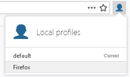

## Table of Contents

* [About the Project](#about-the-project)
* [Getting Started](#getting-started)
  * [Prerequisites](#prerequisites)
  * [Installation](#installation)
* [Usage](#usage)
* [Contributing](#contributing)
* [License](#license)
* [Contact](#contact)


<!-- ABOUT THE PROJECT -->
## About The Project

An extension experiment to make an easier local profile switcher from the main ui similar to what is found in other browsers. **As this only works to ease the switching of local profiles, they are still managed at about:profiles**. As a first POC ( Proof of concept ) this still doesnt answer some questions like *Should Firefox accounts considered a separate profile?* or even *How this integrate with Firefox accounts?*.

<!-- GETTING STARTED -->
## Getting Started

To get a local copy up and running follow these simple steps.

### Prerequisites

As there isnt still a profile api available to webextensions, this needs to make its own experimental api. **This only works in Firefox Nightly with the extensions.experiments.enabled flag enabled**. To do this go to *about:config* search for *extensions.experiments.enabled* and set it to true. In case it doesnt exists, create it.

### Installation

1. Clone the repo
```sh
git clone https://github.com/pudymody/experiment-profile-switcher.git
```
2. Go to *about:debugging* and in the *This nightly* tab click on *Load temporary Add-on...* and select the *manifest.json* file from the repo.


<!-- USAGE EXAMPLES -->
## Usage

Click the new button extension in the main nav, and from there you should be able to switch profiles.




<!-- CONTRIBUTING -->
## Contributing

Contributions are what make the open source community such an amazing place to be learn, inspire, and create. Any contributions you make are **greatly appreciated**.

1. Fork the Project
2. Create your Feature Branch (`git checkout -b feature/AmazingFeature`)
3. Commit your Changes (`git commit -m 'Add some AmazingFeature'`)
4. Push to the Branch (`git push origin feature/AmazingFeature`)
5. Open a Pull Request


<!-- LICENSE -->
## License

Distributed under the GPL-3.0 License. See `LICENSE` for more information.


<!-- CONTACT -->
## Contact

[Federico Scodelaro](https://pudymody.netlify.com) - [@pudymody](https://twitter.com/pudymody) - federicoscodelaro@gmail.com